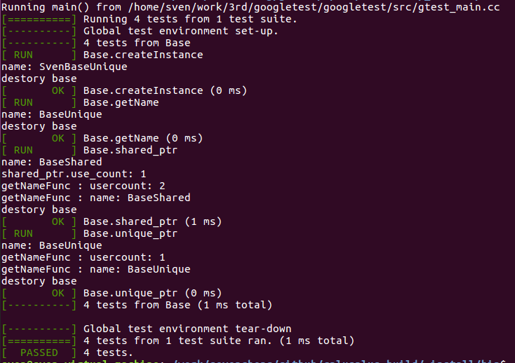

# cplusplus-test

  These are some example of CPP for learning. 
  You can download, compile and run it directly.

## Step1: Clone the example
	Open terminal, and type the following:
```	
	git clone https://github.com/sevencheng798/cplusplus-test.git	
```
## Step 2: to set compile environment if you want to use gtest.
  Open OptionConfig.cmake and modify the variables: GTEST_LIB_DIR and GTEST_INCLUDE_DIR.

## Step3: Run Make to compile
	Create a comile directory.
```
	mkdir cplusplus-build
	cd cplusplus-build
	cmake ${CPLUSPLUS_SOURCE} -DCMAKE_TOOLCHAIN_FILE=${CPLUSPLUS_SOURCE}/OptionConfig.cmake -DCMAKE_INSTALL_PREFIX=./_install -DGTEST_ENABLE=ON
	make
```

## Step4: Run example
```
	./SharedUniqueTEST
```



